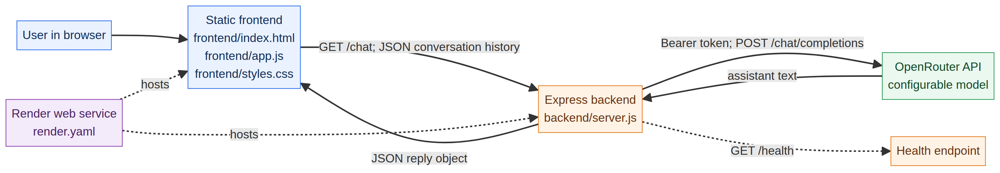

# Orbit Chat — Technical Documentation

**Project:** Orbit Chat, a secure AI chatbot assignment  
**Repository:** [manthanyk/ai-chatbot-assignment](https://github.com/manthanyk/ai-chatbot-assignment)  
**Document status:** Implementation-aligned documentation  
**Author:** Manus AI  
**Last updated:** 18 August 2026

## Scope and implementation note

This document describes the repository as it actually exists. Orbit Chat is a Node.js and Express application with a static browser frontend. It is **not** a conventional MERN application: the frontend is written in vanilla JavaScript rather than React, and the current implementation does not persist data in MongoDB or another database. The absence of a database is intentional for this assignment because the product forwards an in-memory conversation to an AI provider and returns the provider’s response. No fictional React components, MongoDB collections, or live deployment URL are introduced here.

The implementation facts in this document are cross-checked against the server, client, environment template, deployment manifest, tests, and repository structure.[1] [2] [3] [4] [5] [6]

## 1. System Architecture

### 1.1 Architecture overview

Orbit Chat is deployed as one Node.js web service when the included Render manifest is used. Express serves the static files in `frontend/`, exposes the `/health` and `/chat` endpoints, and acts as the only server-side caller of the OpenRouter-compatible AI API. The browser never receives the API key and never calls OpenRouter directly.[1] [4]



### 1.2 Request and response flow

1. A user opens the application in a browser. The Express server serves `frontend/index.html`, `frontend/app.js`, and `frontend/styles.css` from the `frontend/` directory.[1] [2]
2. The user submits a message through the chat form. The browser adds a `{ role, content }` object to its in-memory `messages` array and sends the complete conversation history as JSON to `POST /chat`.[2]
3. Express parses the JSON body, validates the message array, and rejects malformed input before any provider call is attempted. Valid messages may use the `user`, `assistant`, or `system` roles; content must be non-empty and no longer than 4,000 characters; and a request may contain between 1 and 50 messages.[1]
4. The backend reads `OPENROUTER_API_KEY` from the server environment and sends the conversation to the configured OpenAI-compatible endpoint. The default endpoint is `https://openrouter.ai/api/v1/chat/completions`, and the default model is `openai/gpt-4o-mini`.[1] [3]
5. The provider returns a chat-completion response. The backend extracts `choices[0].message.content`, trims it, and returns only `{ "reply": "..." }` to the browser. Provider credentials and the provider response envelope are not exposed to the client.[1]
6. The browser appends the assistant reply to the local conversation history and renders it in the message list. A later request includes the earlier messages, which preserves conversational context during the current browser session.[2]

### 1.3 Hosting and trust boundaries

The intended deployment is a single Render Node web service named `orbit-secure-ai-chatbot`. The manifest defines the build command as `cd backend && npm install --no-audit --no-fund` and the start command as `cd backend && npm start`.[4] Because Express serves the frontend directory, the same service can provide both the user interface and the API. The OpenRouter API key is a server-only secret supplied through Render environment variables. The repository’s ignore rules exclude `.env` files while retaining `.env.example` as a safe configuration template.[5]

The repository does not contain a confirmed production hostname. Consequently, this submission documents the Render configuration and local URL (`http://localhost:3000`) rather than inventing a live URL.

## 2. API Documentation

The backend exposes two application endpoints and one static-file fallback. The API contract below matches `backend/server.js` and the automated tests.[1] [6]

### 2.1 `GET /health`

| Property | Contract |
|---|---|
| Purpose | Report whether the Express service is available. |
| Request body | None. |
| Success response | HTTP `200 OK` with `{ "status": "ok", "service": "secure-ai-chatbot" }`. |
| Error responses | No custom error response is defined for this route. |
| Authentication | None. |

Example:

```http
GET /health
```

```json
{
  "status": "ok",
  "service": "secure-ai-chatbot"
}
```

### 2.2 `POST /chat`

| Property | Contract |
|---|---|
| Purpose | Validate a conversation and return an AI-generated assistant reply. |
| Content type | `application/json` |
| Authentication | No user authentication; the server uses the private `OPENROUTER_API_KEY` environment variable for the provider request. |
| Request body | `{ "messages": Message[] }` |
| Success response | HTTP `200 OK` with `{ "reply": "assistant text" }`. |
| Validation failure | HTTP `400 Bad Request` with `{ "error": "messages must be a non-empty array of valid conversation messages." }`. |
| Missing provider key | HTTP `503 Service Unavailable` with an explanatory configuration error. |
| Provider failure | HTTP `400`, `502`, or `500` depending on the failure path; the client receives `{ "error": "Unable to get an AI response right now." }` for provider/runtime errors. |

The request body must contain a non-empty `messages` array with no more than 50 items. Each item must have a permitted role (`user`, `assistant`, or `system`) and a non-empty string `content` with a maximum length of 4,000 characters.[1]

Valid request:

```http
POST /chat
Content-Type: application/json
```

```json
{
  "messages": [
    { "role": "user", "content": "What is JavaScript?" },
    { "role": "assistant", "content": "JavaScript is a programming language." },
    { "role": "user", "content": "Can you give me an example?" }
  ]
}
```

Successful response:

```json
{
  "reply": "Here is a concise JavaScript example..."
}
```

Invalid request example:

```json
{
  "messages": []
}
```

Invalid request response:

```http
HTTP/1.1 400 Bad Request
```

```json
{
  "error": "messages must be a non-empty array of valid conversation messages."
}
```

### 2.3 Static frontend fallback

For browser navigation that does not match an API route or a static asset, Express sends `frontend/index.html`. This permits the hosted service to provide the user interface and API from one origin. The fallback is not a JSON API endpoint and should not be called by API clients expecting a structured response.[1]

## 3. Data and Database Design

### 3.1 Persistence status

Orbit Chat does **not** use MongoDB, Mongoose, SQL, or another persistent database. There are no database connection strings, models, migrations, or collections in the repository. Conversation state exists only in the browser’s JavaScript memory and is lost when the page is refreshed or the conversation is cleared.[2] [3]

This distinction matters operationally: the backend is stateless between requests, except for the provider call in progress. The complete conversation is sent by the browser on every `/chat` request, so the server does not need to retrieve prior messages from a database.

### 3.2 Runtime entity: `ConversationMessage`

| Field | Type | Constraints | Meaning |
|---|---|---|---|
| `role` | String enum | Required; one of `user`, `assistant`, `system` | Identifies the speaker or instruction source. |
| `content` | String | Required; trimmed length from 1 to 4,000 characters | The message text sent to or returned by the model. |

A `ConversationMessage` is created in the browser when a user submits text or when the assistant response is received. The same shape is validated by the backend before it is passed to the provider.[1] [2]

### 3.3 Runtime entity: `ChatRequest`

| Field | Type | Constraints | Meaning |
|---|---|---|---|
| `messages` | Array of `ConversationMessage` | Required; 1–50 items | The complete conversation history for the current request. |

A `ChatRequest` contains many `ConversationMessage` items. The browser sends the request to `/chat`; the backend validates the array and forwards it to the configured provider. There is no database foreign key because neither entity is persisted.[1] [2]

### 3.4 Relationship and lifecycle

The relationship is **one chat request contains many conversation messages**. A user message is appended before the request is sent; if the provider succeeds, the returned assistant message is appended after the response. If the request fails, the client removes the pending user message from its local array and displays the error status.[2]

## 4. Deployment Documentation

### 4.1 Prerequisites

A fresh machine needs Node.js with npm, Git, and an OpenRouter-compatible API key. The repository is designed to run without a separate frontend build step or database service.

### 4.2 Local setup

Clone the repository and enter the project directory:

```bash
git clone https://github.com/manthanyk/ai-chatbot-assignment.git
cd ai-chatbot-assignment
```

Install backend dependencies:

```bash
cd backend
npm install
```

Create the local environment file from the tracked template:

```bash
cp .env.example .env
```

Edit `.env` and provide the values listed below. Never commit the real `.env` file.

| Variable | Required | Default or example | Description |
|---|---:|---|---|
| `OPENROUTER_API_KEY` | Yes | `your-openrouter-api-key-here` | Secret bearer token used by the backend for the AI provider request. |
| `OPENROUTER_MODEL` | No | `openai/gpt-4o-mini` | Provider model identifier sent in the chat-completion body. |
| `OPENROUTER_BASE_URL` | No | `https://openrouter.ai/api/v1/chat/completions` | OpenAI-compatible chat-completions endpoint. |
| `APP_URL` | No | `http://localhost:3000` | Referer value sent to the provider and the expected public application URL in deployment. |
| `PORT` | No | `3000` | TCP port used by the Express server. |

Start the server from the `backend` directory:

```bash
npm start
```

Open the application at [http://localhost:3000](http://localhost:3000). The health check is available at [http://localhost:3000/health](http://localhost:3000/health).

### 4.3 Test command

Run the automated backend checks from `backend/`:

```bash
npm test
```

The test suite verifies message validation, the health response, invalid `/chat` requests, authorization-header forwarding, conversation-history forwarding, and extraction of the provider reply.[6]

### 4.4 Render deployment

The repository includes `render.yaml`, which defines the intended single-service deployment.[4] In Render, create a Blueprint or web service from the repository and confirm the following configuration:

| Render setting | Value |
|---|---|
| Service name | `orbit-secure-ai-chatbot` |
| Runtime | Node |
| Plan | Free, as specified in the manifest |
| Build command | `cd backend && npm install --no-audit --no-fund` |
| Start command | `cd backend && npm start` |
| Secret variable | `OPENROUTER_API_KEY` — set it in Render, not in Git |
| Model variable | `OPENROUTER_MODEL` — defaults to `openai/gpt-4o-mini` |
| Application URL variable | `APP_URL` — set it to the deployed service URL |

After deployment, verify both `https://<render-service>/health` and the root application URL. A production URL is not documented here because this repository does not include a confirmed Render hostname.

## 5. Codebase Structure

The following tree reflects the tracked project files and explains where a new developer should look first.

```text
ai-chatbot-assignment/
├── backend/
│   ├── .env.example       ← Safe template for provider, URL, and port configuration
│   ├── package.json       ← Backend scripts and Express, CORS, and dotenv dependencies
│   ├── package-lock.json  ← Locked backend dependency versions
│   └── server.js          ← Express app, validation, provider call, API routes, and static hosting
│
├── frontend/
│   ├── index.html         ← Accessible Orbit Chat page and chat form markup
│   ├── app.js             ← In-memory conversation state and relative POST /chat client
│   └── styles.css         ← Responsive visual design for the chat interface
│
├── tests/
│   └── backend.test.js    ← Node test-runner checks for validation, health, and provider behavior
│
├── docs/
│   ├── architecture.mmd   ← Editable Mermaid source for the architecture diagram
│   ├── architecture.png   ← Rendered architecture diagram used in this document
│   └── technical-documentation.md ← Source for this assignment deliverable
│
├── render.yaml            ← Render Blueprint configuration for the Node web service
├── .gitignore             ← Excludes secrets, dependencies, logs, and generated coverage
└── README.md              ← Project overview, security notes, local run instructions, and deployment notes
```

## Verification checklist

| Requirement | Evidence in this document |
|---|---|
| System architecture | Section 1 and the project-specific diagram. |
| Every backend API endpoint | Section 2 documents `/health`, `/chat`, and the static fallback behavior. |
| At least two data entities and their relationship | Section 3 documents `ConversationMessage` and `ChatRequest`, while explicitly stating that they are runtime structures rather than database collections. |
| Deployment instructions | Section 4 includes clone, install, environment variables, start, test, and Render commands. |
| Codebase structure | Section 5 reflects the repository’s actual tracked files. |
| Project-specific accuracy | The document names Orbit Chat, OpenRouter, exact routes, exact environment variables, exact scripts, and the absence of a database. |

## References

[1]: ../backend/server.js "Orbit Chat Express backend and API implementation"

[2]: ../frontend/app.js "Orbit Chat browser client and conversation state"

[3]: ../backend/.env.example "Orbit Chat environment variable template"

[4]: ../render.yaml "Orbit Chat Render deployment manifest"

[5]: ../.gitignore "Orbit Chat repository ignore rules"

[6]: ../tests/backend.test.js "Orbit Chat backend contract tests"
